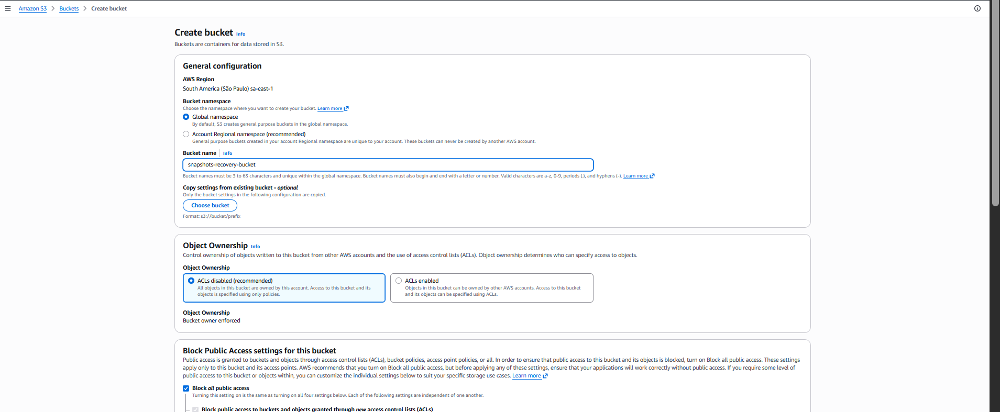

# Restore Procedure (Disaster Recovery Test)

This step demonstrates how to restore an EBS snapshot created by the Automated EBS Backup & Recovery System.


## DISASTER RECOVERY SIMULATION

The testing scneario covers situation when one availability zone is down and I need to recover the system using only the replicated snapshot.

**London** (`eu‑west‑2`) is **DOWN** and only surviving backups are in **Sao Paulo** (`sa‑east‑1`).

My task is to recover the system using only the replicated snapshot.


1. Identify the latest replicated snapshot in `sa-east-1` Sao Paulo

Snapshot with:

- CreatedBy = SnapshotAutomation
- NeedsReplication = False
- The latest timestamp


Will use the snapshot ID `snap-0e2c474f00924fe2e`

2. Create Volume

In EC2 Dashboard I navigate to Snapshots:

- Region: `sa‑east‑1`
- Select my snapshot created in the step above and then create volume with the settings: Availability Zone: `sa‑east‑1a (or any AZ)`, Volume type: `gp3`, size: `same as original`


3. Launch a replacement EC2 instance in Sao Paulo

Because London is “down”, I will launch a new instance in the DR region:

- Region: `sa‑east‑1`
- AMI: `Amazon Linux`
- Instance type: `t2.micro`
- Security group: `allow SSH from my IP`

and after the instance is running I will attach the restored volume:

- In EC2 Dashboard select Volumes and select the volume created above and attach volume
- Choose the new EC2 instance
- Device name: /dev/sdf (AWS will map it automatically)


4. Mount the restored volume inside the instance

SSH from CloudShell into the EC2 Instance:

`ssh -i yourkey.pem ec2-user@<public-ip>`

List the block devices to identify the attached volumes:

```console
[ec2-user@ip-172-31-44-101 ~]$ lsblk
NAME      MAJ:MIN RM SIZE RO TYPE MOUNTPOINTS
xvda      202:0    0  10G  0 disk 
├─xvda1   202:1    0  10G  0 part /
├─xvda127 259:0    0   1M  0 part 
└─xvda128 259:1    0  10M  0 part /boot/efi
xvdf      202:80   0   8G  0 disk 
xvdg      202:96   0   8G  0 disk 
├─xvdg1   202:97   0   8G  0 part 
├─xvdg127 259:2    0   1M  0 part 
└─xvdg128 259:3    0  10M  0 part
```

Running commands below to identify the filesystem, mount the recovered EBS volume, and confirm it contains the core directories of a functioning Linux OS:

```console
[ec2-user@ip-172-31-44-101 ~]$ sudo file -s /dev/xvdg1
/dev/xvdg1: SGI XFS filesystem data (blksz 4096, inosz 512, v2 dirs)
[ec2-user@ip-172-31-44-101 ~]$ sudo mkdir -p /mnt/recovery
[ec2-user@ip-172-31-44-101 ~]$ sudo mount -t xfs /dev/xvdg1 /mnt/recovery
[ec2-user@ip-172-31-44-101 ~]$ ls /mnt/recovery
bin  boot  dev  etc  home  lib  lib64  local  media  mnt  opt  proc  root  run  sbin  srv  sys  tmp  usr  var
[ec2-user@ip-172-31-44-101 ~]$ 
```

Explore the filesystem

```console
ls /mnt/recovery/home
ls /mnt/recovery/var/log
```

I can now see the entire recovered operating system, the real one from the original instance.

```console
[ec2-user@ip-172-31-44-101 ~]$ ls /mnt/recovery/home
ec2-user
```

And these are the real system logs from the original machine.

```console
[ec2-user@ip-172-31-44-101 ~]$ ls /mnt/recovery/var/log
README  amazon  audit  btmp  chrony  cloud-init-output.log  cloud-init.log  dnf.librepo.log  dnf.log  dnf.rpm.log  hawkey.log  journal  lastlog  private  sa  sssd  tallylog  wtmp
```

5. Create S3 Bucket in São Paulo and Upload Recovered Data

In this step I'm creating a new bucket in Sao Paulo Brazil (`sa‑east‑1`) region so the recovered data could be stored and accessed locally within the same region during the disaster‑recovery process.



Copy the recovered my home directory to S3:

```console
[ec2-user@ip-172-31-44-101 ~]$ aws s3 cp /mnt/recovery/home/ec2-user s3://snapshots-recovery-bucket/recovery/home/ --recursive
upload: ../../mnt/recovery/home/ec2-user/.bash_logout to s3://snapshots-recovery-bucket/recovery/home/.bash_logout
upload: ../../mnt/recovery/home/ec2-user/.bashrc to s3://snapshots-recovery-bucket/recovery/home/.bashrc
upload: ../../mnt/recovery/home/ec2-user/.bash_profile to s3://snapshots-recovery-bucket/recovery/home/.bash_profile
upload: ../../mnt/recovery/home/ec2-user/.ssh/authorized_keys to s3://snapshots-recovery-bucket/recovery/home/.ssh/authorized_keys

```


and verify the upload:

```console
~ $ aws s3 ls s3://snapshots-recovery-bucket/recovery/home/ --recursive
2026-04-11 22:17:01         18 recovery/home/.bash_logout
2026-04-11 22:17:01        141 recovery/home/.bash_profile
2026-04-11 22:17:01        492 recovery/home/.bashrc
2026-04-11 22:17:01        396 recovery/home/.ssh/authorized_keys
```

Running `ls -lah /mnt/recovery` shows the recovered filesystem structure:

```console
[ec2-user@ip-172-31-44-101 ~]$ ls -lah /mnt/recovery
total 32K
dr-xr-xr-x. 18 root root 237 Apr  4 01:58 .
drwxr-xr-x.  3 root root  22 Apr 11 13:16 ..
lrwxrwxrwx.  1 root root   7 Jan 30  2023 bin -> usr/bin
dr-xr-xr-x.  5 root root 16K Apr  4 02:00 boot
drwxr-xr-x.  3 root root 136 Apr  4 02:02 dev
drwxr-xr-x. 76 root root 16K Apr 10 16:16 etc
drwxr-xr-x.  3 root root  22 Apr 10 16:16 home
lrwxrwxrwx.  1 root root   7 Jan 30  2023 lib -> usr/lib
lrwxrwxrwx.  1 root root   9 Jan 30  2023 lib64 -> usr/lib64
drwxr-xr-x.  2 root root   6 Apr  4 01:56 local
drwxr-xr-x.  2 root root   6 Jan 30  2023 media
drwxr-xr-x.  2 root root   6 Jan 30  2023 mnt
drwxr-xr-x.  3 root root  17 Apr  4 02:00 opt
drwxr-xr-x.  2 root root   6 Apr  4 01:56 proc
dr-xr-x---.  3 root root 103 Apr  4 02:00 root
drwxr-xr-x.  2 root root   6 Apr  4 02:02 run
lrwxrwxrwx.  1 root root   8 Jan 30  2023 sbin -> usr/sbin
drwxr-xr-x.  2 root root   6 Jan 30  2023 srv
drwxr-xr-x.  2 root root   6 Apr  4 01:56 sys
drwxrwxrwt.  2 root root   6 Apr  4 01:56 tmp
drwxr-xr-x. 12 root root 144 Apr  4 01:58 usr
drwxr-xr-x. 19 root root 266 Apr 10 16:16 var
```

This confirms that the recovered volume contains the core directories of a functioning Linux operating system.